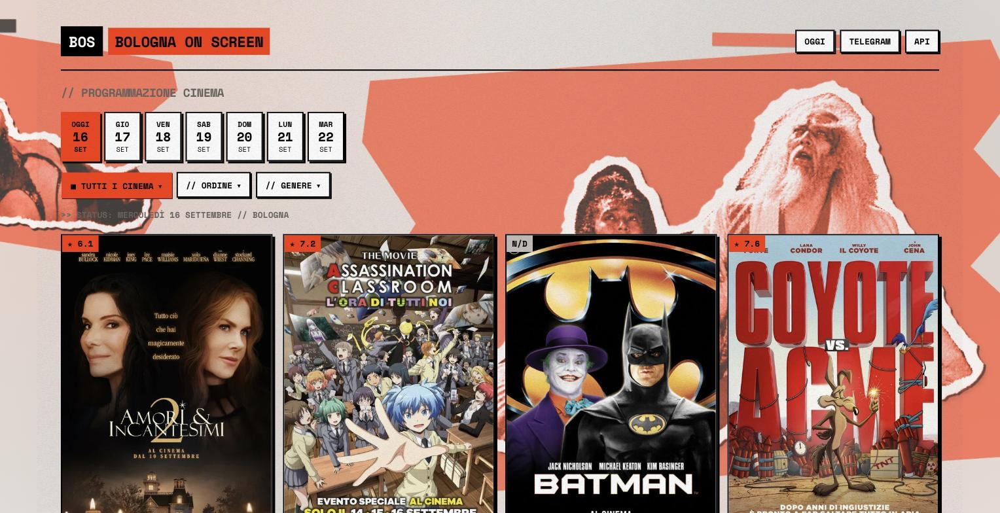

# BOS — Bologna on Screen




Mini-sito con la programmazione cinematografica giornaliera di Bologna per cinque
circuiti, aggiornata automaticamente ogni giorno — più un bot Telegram compagno per
consultarla senza aprire il sito. Attivo 24/7 su Oracle Cloud:

- **Cineteca di Bologna** (Lumiere, Modernissimo)
- **Pop Up Cinema** (Jolly, Arlecchino, Medica)
- **Circuito Cinema Bologna** (Rialto, Odeon, Europa, Roma D'Azeglio)
- **Nuovo Cinema Nosadella** (Sala Berti, Sala Scalo)
- **UCI Cinemas Meridiana** (Bologna)

## Funzionalita'

- **Mini-sito web**: card film con locandina, rating, generi e orari; filtri per cinema/genere; ordinamento per ora/titolo; navigazione tra 7 giorni; auto-refresh ogni 15 min
- **Enrichment TMDb**: rating, genere, poster ad alta risoluzione, sinossi, durata (cache locale TTL 7 giorni)
- **Link di acquisto**: 18tickets (Cineteca, Pop Up, Circuito, Nosadella) + UCI Cinemas (API diretta)
- **Bot Telegram**: broadcast giornaliero + comando `/cinema` per consultazione istantanea

## Quick start

```bash
git clone https://github.com/Priestomm/bologna-cinema-scraper.git
cd scraper-cinema-bologna
python3 -m venv .venv && source .venv/bin/activate
pip install -r requirements.txt
cp .env.example .env  # poi inserisci le 3 chiavi
make run
```

Le chiavi si ottengono da:
- **TELEGRAM_BOT_TOKEN**: [@BotFather](https://t.me/BotFather) → `/newbot`
- **TELEGRAM_CHAT_ID**: `curl "https://api.telegram.org/bot<TOKEN>/getUpdates"`
- **TMDB_API_KEY**: [themoviedb.org](https://www.themoviedb.org/) → Settings > API

## Variabili d'ambiente

| Variabile | Default | Descrizione |
|---|---|---|
| `TELEGRAM_BOT_TOKEN` | *(richiesto)* | Token da @BotFather |
| `TELEGRAM_CHAT_ID` | *(richiesto)* | Chat ID di destinazione |
| `TMDB_API_KEY` | *(opzionale)* | Chiave API TMDb per rating/sinossi |
| `SCRAPE_CRON_HOUR` / `MINUTE` | 7:30 | Orario scraping giornaliero |
| `BROADCAST_CRON_HOUR` / `MINUTE` | 8:00 | Orario broadcast Telegram |
| `SCRAPER_TIMEOUT` | 15 | Timeout per singolo scraper (secondi) |
| `HEALTH_PORT` | 8080 | Porta del server web (0 = disabilitato) |
| `REFRESH_INTERVAL_MINUTES` | 15 | Intervallo auto-refresh mini-sito |

## Uso

```bash
make help              # tutti i comandi
make run               # bot + sito in foreground
make scrape            # scraping singolo giorno
python main.py --scrape --days 7  # scraping 7 giorni
make broadcast         # test invio reale
```

### Deploy

```bash
# Docker
docker compose up -d

# PM2
pm2 start ecosystem.config.js
pm2 save && pm2 startup
```

Il sito e' attualmente ospitato su Oracle Cloud (always-free tier) con PM2.

### Health check

```bash
curl http://localhost:8080/health
open http://localhost:8080/              # mini-sito oggi
open http://localhost:8080/2026-09-15    # data specifica
```

## API REST

| Endpoint | Descrizione |
|---|---|
| `GET /` | Mini-sito HTML — programmazione di oggi |
| `GET /{YYYY-MM-DD}` | Mini-sito HTML — data specifica |
| `GET /robots.txt` | Direttive per i crawler |
| `GET /sitemap.xml` | Sitemap (oggi + prossimi 7 giorni) |
| `GET /health` | Stato del bot (uptime, conteggio film, avvisi) |
| `GET /api/screenings?date=YYYY-MM-DD` | Programmazione per data |
| `GET /api/cinemas` | Elenco cinema con conteggio film |
| `GET /api/cinemas/{name}` | Film di un cinema specifico |
| `GET /api/history?days=N` | Storico ultimi N giorni (max 90) |
| `GET /api/stats` | Statistiche generali |
| `POST /api/refresh` | Forza refresh dati |
| `GET /api/refresh/status` | Stato del refresh |

Documentazione interattiva: `http://localhost:8080/docs`

## Architettura

```
main.py              # entry point (bot | --scrape | --broadcast)
Makefile             # comandi rapidi
config/settings.py   # carica .env, costanti
scrapers/            # scraper per circuito + client TMDb
  base.py            # BaseScraper + modello Screening
  _tickets18.py      # parser condiviso 18tickets
  cineteca.py, circuito.py, nosadella.py, popup.py, uci.py
  tmdb.py            # client TMDb con cache SQLite
database/cache.py    # cache SQLite snapshot giornalieri
bot/
  pipeline.py        # orchestratore scraper -> enrichment -> cache
  scheduler.py       # APScheduler (scrape + broadcast)
  formatter.py       # rendering messaggi Telegram
  health.py          # FastAPI: mini-sito + API REST
  telegram_bot.py    # handler /cinema + lifecycle
  templates/         # template Jinja2 per il mini-sito
tests/               # test unitari (pytest)
```

Gli scraper girano in parallelo con timeout configurabile. Il formatter aggiunge automaticamente una sezione "Avvisi" con i circuiti non disponibili.

## Troubleshooting

| Sintomo | Fix |
|---|---|
| `/cinema` risponde "Cache vuota" | `python main.py --scrape --days 7` |
| Film senza rating/sinossi | Verifica `TMDB_API_KEY` in `.env` |
| `Conflict: terminated by other getUpdates` | Due istanze attive → `pm2 list`, killa la duplicata |
| Un circuito in "Avvisi" | Sito offline o selettori HTML cambiati → aggiorna lo scraper |

## Note

- I dati vengono estratti da pagine pubbliche e API pubbliche, senza login ne' bypass di paywall.
- TMDb viene usato solo per arricchire i dati. Nessun dato utente viene inviato.
